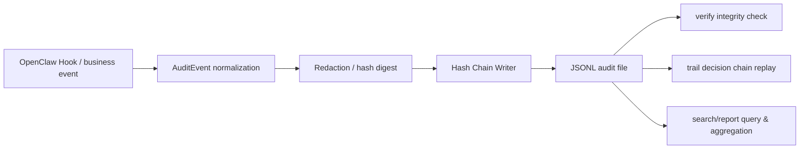

agent-audit-trail
==================

Tamper-evident audit trail system for AI agents.

It generates verifiable, hash-chained JSONL logs for key agent behaviors, helping you answer three kinds of real-world questions:

- What exactly did the agent do?
- How was this reply or tool call produced step by step?
- Has anyone silently edited these records afterwards?

This repo contains two parts:

- `agent-audit-trail`: framework-agnostic core audit library
- `@openclaw/audit-trail`: OpenClaw plugin / adapter layer

It is suitable for OpenClaw, internal agent platforms, automated workflows, compliance audits, incident review, and security forensics.

---

## TL;DR on one page

If you just want to quickly decide whether this project is worth your time, read these 5 points:

- It is **not** a generic logging tool, but a **verifiable audit chain** for AI agents.
- It answers not only *“what happened”* but also *“why it happened this way”*.
- It can detect whether logs were modified, deleted, or overwritten after the fact.
- It works both as a TypeScript core library and as a plug-and-play OpenClaw plugin.
- It naturally supports incident review, compliance evidence, security auditing, and tracking high‑risk operations.

In one sentence:

> If your agent is already calling models, executing tools, or reading/writing files, `agent-audit-trail` is no longer about “do we have logs?” but “do we have a trustworthy history?”.

---

## Project overview

OpenClaw is a self-hosted gateway for AI agents, connecting channels, conversations, models, and tools. Once agents start reading/writing files, running shell commands, and touching external services, plain logs are rarely enough for real-world accountability and post‑mortem analysis.

`agent-audit-trail` is **not** about writing “one more log”. Its goal is to turn agent behavior into a verifiable, queryable, reconstructable **evidence chain**:

- Use structured events to record the agent lifecycle.
- Use a hash chain to detect tampering after the fact.
- Use `runId` / `sessionId` to reconstruct full decision traces.
- Use reporting and search capabilities to support audit, operations, and security analysis.

---

## Vision

We want to add a missing but increasingly critical piece of infrastructure for AI agents:

- For developers: it turns agent behavior from a black box into something you can inspect and reason about.
- For platform teams: it provides a unified data foundation for debugging, troubleshooting, and accountability.
- For enterprise users: it makes agents closer to production‑ready, auditable, governable systems.

Agents will get more powerful, but strong capabilities must be matched with strong visibility. This project turns that *visibility* into a reusable, verifiable, and easily integrated component.

---

## Value

### 1. From “we have logs” to “we have evidence”

Plain logs are readable, but they rarely prove they haven’t been edited. `agent-audit-trail` maintains `prevHash` and `hash` for each record; any overwrite, deletion, insertion, or in‑place modification of historical records will be detected during verification and pinpointed to a specific `seq`.

### 2. From “we know something went wrong” to “we know how it went wrong”

With only text logs, it is hard to reconstruct a complete agent run. With fields like `runId`, `sessionId`, and `toolCallId`, you can stitch a conversation, a round of LLM reasoning, and a sequence of tool calls into a full decision trajectory.

### 3. Balancing privacy and auditability

By default, `metadata_only` mode does **not** store raw content. It records lengths, digests, and essential metadata instead. When you need more debug power, you can switch to `full_capture` and combine it with field‑level redaction.

### 4. Local debugging and production readiness

You can:

- Embed it as a standalone TypeScript library into **any** agent system, or
- Plug it into OpenClaw as a first-class plugin for the existing gateway and CLI flows.

---

## Why it’s not “just logging”

Many systems already have logs. What’s missing for **agent auditing** is usually not “printing more content”, but capabilities like these:

| Aspect | Plain logging | `agent-audit-trail` |
|--------|---------------|---------------------|
| Record format | Text or ad‑hoc structured logs | Unified `AuditEvent` event model |
| Tamper detection | Usually none | Hash‑chain verification, pinpoint by `seq` |
| Decision chain replay | Manually stitch context | Replay via `runId` / `sessionId` |
| Privacy control | Often “log everything or nothing” | `metadata_only` plus field‑level redaction |
| Production focus | Mainly debugging | Debugging, audit, compliance, and archiving |
| OpenClaw integration | Manual instrumentation | Direct hooks + CLI support |

If you only want to debug a small piece of code, logs are enough.  
If your goal is **long‑term tracking of agent behavior**, rebuilding chains after incidents, and providing credible evidence externally, you need a different class of tooling.

---

## What problems does it solve?

### Typical questions

- A user disputes: *“I never asked the agent to do this. Why did it run that tool?”*
- The security team needs to confirm whether logs within a time range were modified.
- The operations team wants to know what happened immediately before and after an abnormal call.
- The compliance team needs an audit summary for a given period.

### Matching capabilities

- `verify`: validate log integrity and detect tampering.
- `trail`: reconstruct decision chains by `runId` / `sessionId` / `agentId`.
- `search`: filter events by type, tool name, time range, etc.
- `report`: generate compliance‑oriented and analytical summary reports.

---

## End‑to‑end workflow

From agent behavior to audit output, the flow looks like this:



In OpenClaw, the plugin subscribes to hooks as an observer. It only records events and **never** changes the original agent behavior.

---

## Core capabilities

- Hash‑chained audit logs with tamper detection.
- Behavior tracking by `runId` / `sessionId` / `agentId`.
- Two capture modes: `metadata_only` and `full_capture`.
- Field‑level redaction: `hash` / `omit` / `truncate`.
- Log rotation strategies: `daily` / `session` / `size`.
- OpenClaw‑oriented CLI: `verify` / `trail` / `report` / `search`.
- Framework‑agnostic core library for integration with other agent platforms.

---

## Use cases

- Behavior auditing and security troubleshooting for the OpenClaw gateway.
- Compliance evidence for internal enterprise AI assistants.
- Incident review for automated execution pipelines.
- Auditing and archiving of high‑risk tool calls.
- Feeding agent behavior into SIEM, risk control, or audit platforms.

---

## Getting started

If you don’t know where to begin, we recommend this order:

1. Run `examples/standalone-demo.mjs` once.
2. Understand what `verify` / `trail` / `report` / `search` do.
3. Decide whether to embed it into your own agent system or plug it into OpenClaw.

---

### 1. Install & build

```bash
git clone https://github.com/kanson1996/agent-audit-trail.git
cd agent-audit-trail
pnpm install
pnpm build
```

Common dev commands:

```bash
pnpm test
pnpm test:coverage
```

### 2. Run the standalone demo first

This is the best way to understand the project:

```bash
# Full workflow: write → verify → replay trail → compliance report → tamper detection
node examples/standalone-demo.mjs
```

Example output:

```text
📁 Log directory: /tmp/audit-demo-xxx

Step 1: Writing audit logs...
  ✓ 8 AuditEvent records written

Step 2: Verifying hash chain integrity...
  ✓ ...audit-2026-03-13.jsonl — events: 8, valid: true
  Result: 1/1 file(s) valid

Step 3: Rebuilding decision chain for run run-xyz-001...
  Found 4 related events:
  [00:00:00] llm_input
  [00:00:00] tool_call_after → bash
  [00:00:00] tool_call_after → read_file
  [00:00:00] llm_output

Step 5: Demonstrating tamper detection...
  ✗ ...audit-2026-03-13.jsonl
    TAMPERED at seq=2 — Hash mismatch at seq 2: ...
```

If you just want to see “what value this project provides” in a few minutes, running this single demo is enough.

---

## Understand usage in 3 minutes

### Option 1: Use as a standalone core package

No dependency on OpenClaw — integrate it directly into your agent system:

```typescript
import { AuditWriter, verifyDirectory, readTrail, generateReport, formatReportText }
  from "agent-audit-trail";

const config = {
  logDir: "~/.myapp/audit",
  captureMode: "metadata_only",
  rotation: { strategy: "daily" },
  redaction: { mode: "hash", fields: [] },
  captureBeforeToolCall: false,
};

const writer = new AuditWriter({ config });

writer.append({
  type: "llm_input",
  timestamp: new Date().toISOString(),
  runId: "run-001",
  sessionId: "s-001",
  payload: {
    provider: "anthropic",
    model: "claude-sonnet-4-6",
    historyMessageCount: 3,
  },
});

writer.append({
  type: "tool_call_after",
  timestamp: new Date().toISOString(),
  runId: "run-001",
  payload: { toolName: "bash", success: true, durationMs: 120 },
});

await writer.flush();

const verify = await verifyDirectory("~/.myapp/audit");
console.log(`${verify.validFiles}/${verify.checkedFiles} file(s) valid`);

const trail = await readTrail("~/.myapp/audit", { runId: "run-001" });
console.log(trail.map((ev) => ev.type));

const report = await generateReport({ logDir: "~/.myapp/audit" });
console.log(formatReportText(report));
```

A full runnable example is in [`examples/standalone-demo.mjs`](./examples/standalone-demo.mjs).

### Option 2: Use as an OpenClaw plugin

If you’re already using OpenClaw, this is the most natural integration path. The plugin automatically converts key hooks for sessions, LLM, tools, etc. into standardized audit events.

---

## Integrate with OpenClaw

### Installation

**Option 1: Install from npm**

```bash
openclaw plugins install @openclaw/audit-trail
```

**Option 2: Local dev install**

```bash
git clone https://github.com/kanson1996/agent-audit-trail.git
cd agent-audit-trail
pnpm install
pnpm build

openclaw plugins install --link ./extensions/openclaw-audit-trail
```

Verify installation:

```bash
openclaw plugins list
openclaw plugins info audit-trail
```

### Configure the plugin

In `~/.openclaw/openclaw.json`:

```json
{
  "plugins": {
    "entries": {
      "audit-trail": {
        "config": {
          "logDir": "~/.openclaw/audit-trail",
          "captureMode": "metadata_only",
          "rotation": { "strategy": "daily" },
          "redaction": { "mode": "hash" },
          "captureBeforeToolCall": false
        }
      }
    }
  }
}
```

Once the gateway is running, the plugin will automatically record key OpenClaw lifecycle events.

---

## How it works inside OpenClaw

The plugin currently subscribes to these events:

- `session_start`
- `session_end`
- `message_received`
- `message_sent`
- `llm_input`
- `llm_output`
- `before_tool_call` (optional)
- `after_tool_call`
- `agent_end`
- `subagent_spawned`
- `subagent_ended`

These hooks are mapped to a unified `AuditEvent` model and written into the same hash chain. All hooks are `void` observers and never modify or block original agent behavior.

---

## Common workflows

### 1. Verify log integrity

```bash
openclaw audit verify
openclaw audit verify --from 2026-03-01 --to 2026-03-13
openclaw audit verify --json | jq '.results[] | select(.valid == false)'
```

Exit codes:

- `0`: all files valid
- `1`: tampered or corrupted data found

### 2. Rebuild a single agent decision chain

```bash
openclaw audit trail --run <runId>
openclaw audit trail --session <sessionId>
openclaw audit trail --agent <agentId>
openclaw audit trail --run <runId> --json
```

### 3. Generate audit summary reports

```bash
openclaw audit report --from 2026-03-01
openclaw audit report --format json
```

### 4. Search for specific audit events

```bash
openclaw audit search --type tool_call_after
openclaw audit search --tool bash --from 2026-03-13T00:00:00Z
```

### 5. Typical troubleshooting path

```text
First run verify to check whether logs are trustworthy
  ↓
If tampering or damage is found, mark the affected files as untrusted
  ↓
If logs are intact, use trail to follow a specific run / session
  ↓
Optionally use search to narrow the scope, then report to summarize
```

---

## A typical audit loop

In real usage, it usually looks like this:

1. OpenClaw runs normally, and the plugin keeps writing audit logs.
2. `verify` is run regularly to check log integrity.
3. When something abnormal happens, `trail` is used to reconstruct the behavior chain for a specific run or session.
4. `search` and `report` are used to summarize high‑risk behaviors, trends, and evidence.
5. JSON output is integrated with security platforms, object storage, or SIEM.

This is the core value of the project: turning agent behavior from a **runtime phenomenon** into a **verifiable historical record**.

---

## Security model

### Tamper‑evident mechanism

Each `AuditEvent` includes:

```json
{
  "seq": 3,
  "prevHash": "a3f2... (SHA-256 of previous record)",
  "hash": "d8f1... (SHA-256 of this record)",
  "type": "tool_call_after",
  "timestamp": "2026-03-13T10:00:03.000Z",
  "runId": "run-xyz",
  "payload": { "toolName": "bash", "success": true }
}
```

Verification has two layers:

- Whether the current record’s `hash` matches the canonicalized content.
- Whether the current record’s `prevHash` equals the previous record’s `hash`.

If any historical record is edited by even one byte, deleted, inserted, or overwritten, the hash chain breaks. `verify` will flag the problem and pinpoint the offending `seq`.

### Canonical JSON

`canonicalJson` sorts object keys in a stable order before serialization, ensuring identical content always yields the same hash and avoiding false positives due to normal JSON serialization differences.

### Privacy protection

| Mode | Behavior | Best for |
|------|----------|----------|
| `metadata_only` | Do not store raw content; store length, digest, and essential metadata only | Default, production |
| `full_capture` | Store full content; can be combined with field‑level redaction | Debugging, forensics |

Redaction config example:

```json
{
  "redaction": {
    "mode": "hash",
    "fields": ["payload.content", "payload.params.password"],
    "truncateLength": 64
  }
}
```

### Concurrency safety

`HashChainWriter` uses a promise queue to serialize writes to a single file, preventing race conditions and chain corruption from concurrent `append()` calls.

---

## Log layout

Default directory structure:

```text
~/.openclaw/audit-trail/
├── index.jsonl
└── 2026-03-13/
    └── audit-2026-03-13.jsonl
```

- `index.jsonl`: global file index.
- `audit-YYYY-MM-DD.jsonl`: date‑rotated audit files.

---

## Architecture

```text
agent-audit-trail/
├── packages/core/                    # Framework-agnostic core package
│   └── src/
│       ├── types.ts
│       ├── canonical-json.ts
│       ├── hash-chain.ts
│       ├── writer.ts
│       ├── redactor.ts
│       ├── verifier.ts
│       ├── reader.ts
│       └── reporter.ts
│
├── extensions/openclaw-audit-trail/ # OpenClaw plugin
│   ├── index.ts
│   └── src/
│       ├── config.ts
│       ├── hooks.ts
│       └── cli.ts
│
└── examples/
    └── standalone-demo.mjs
```

Benefits of this two‑layer design:

- `packages/core` can be reused with any agent framework.
- `extensions/openclaw-audit-trail` focuses on OpenClaw hooks, CLI, and configuration.

---

## Hook → AuditEvent mapping

| Hook | AuditEventType | `runId` source |
|------|----------------|----------------|
| `session_start` | `session_start` | — |
| `session_end` | `session_end` | — |
| `message_received` | `message_received` | — |
| `message_sent` | `message_sent` | — |
| `llm_input` | `llm_input` | `event.runId` |
| `llm_output` | `llm_output` | `event.runId` |
| `before_tool_call` | `tool_call_before` | `event.runId` |
| `after_tool_call` | `tool_call_after` | `event.runId` |
| `agent_end` | `agent_end` | — |
| `subagent_spawned` | `subagent_spawned` | `event.runId` |
| `subagent_ended` | `subagent_ended` | `event.runId` |

> `before_tool_call` is only enabled when `captureBeforeToolCall: true`.

---

## Config reference

| Field | Type | Default | Description |
|-------|------|---------|-------------|
| `logDir` | string | `~/.openclaw/audit-trail` | Log directory |
| `captureMode` | `metadata_only` \| `full_capture` | `metadata_only` | Content capture mode |
| `rotation.strategy` | `daily` \| `session` \| `size` | `daily` | Log rotation strategy |
| `rotation.maxSizeBytes` | number | — | Threshold for size‑based rotation |
| `redaction.mode` | `hash` \| `omit` \| `truncate` | `hash` | Redaction strategy |
| `redaction.fields` | string[] | `[]` | Field paths to redact |
| `enabledEvents` | `AuditEventType[]` | all | Only record these events |
| `captureBeforeToolCall` | boolean | `false` | Whether to record parameters before tool call |

Recommended starting config:

```json
{
  "logDir": "~/.openclaw/audit-trail",
  "captureMode": "metadata_only",
  "rotation": { "strategy": "daily" },
  "redaction": { "mode": "hash" },
  "captureBeforeToolCall": false
}
```

Config tips:

- For initial integration, `metadata_only + daily` is the safest default.
- Only enable `full_capture` for debugging or targeted investigations.
- If tool parameters are sensitive, prefer field‑level redaction over “no logging at all”.

---

## Manually verify tamper detection

```bash
# 1. Generate a batch of normal logs
node examples/standalone-demo.mjs

# 2. Or run real conversations in OpenClaw, then verify
openclaw audit verify

# 3. Manually edit some payload field, then verify again
openclaw audit verify
```

Expected result:

```text
✗ ...audit-2026-03-13.jsonl — TAMPERED at seq=3
```

This means the logs are no longer trustworthy — but it also proves that tampering was successfully detected and located.

---

## FAQ

### Will appending new logs cause false tamper alarms?

No. Normal appends do not break the hash chain. `verify` only reports issues when historical records are overwritten, deleted, inserted, or partially corrupted.

### Does it store all conversation content?

By default, no. The default `metadata_only` mode is production‑oriented: it stores lengths, digests, and essential metadata instead of raw text. Only switch to `full_capture` when you need stronger debugging or forensics.

### Is this useful if I’m just an individual developer?

Yes, but with a different focus. For individuals, it’s more like a **high‑quality debugging and review tool**. For enterprises and platform teams, it also becomes **compliance and forensics infrastructure**.

### If a log file is deleted, is that “tampering”?

From the perspective of existing files, deletion is not “internal file tampering” but “missing logs”. In production, this is usually handled using archival, backup, centralized collection, and periodic verification together.

### Should I start with the core package or the OpenClaw plugin?

- If you already use OpenClaw: start with the plugin.
- If you have your own agent framework: start with the core package.
- If you’re still evaluating value: run the demo first, then pick a path.

---

## Development

```bash
pnpm install
pnpm build
pnpm test
pnpm test:coverage
```

Conventions:

- Test files live next to sources, named `*.test.ts`.
- The core package stays framework‑agnostic.
- OpenClaw is wired in via `peerDependency`.

---

## Publishing to npm (maintainers)

This repo is a monorepo with two packages. To publish:

```bash
# 1. Publish core package
cd packages/core
npm publish --access public

# 2. Update workspace dependency versions in the plugin package
cd ../../extensions/openclaw-audit-trail

# 3. Publish plugin package
npm publish --access public
```

> Before publishing to npm, replace `workspace:*` with real version numbers.

---

## License

Apache-2.0

