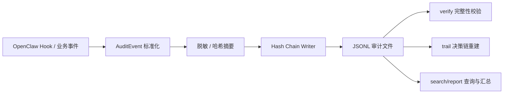

# agent-audit-trail

面向 AI Agent 的防篡改审计溯源系统。

它为 Agent 的关键行为生成可验证的哈希链式 JSONL 日志，帮助你回答三类现实问题：

- Agent 到底做了什么
- 这次回复或工具调用是怎么一步步形成的
- 这些记录后来有没有被人悄悄改过

本项目包含两部分：

- `agent-audit-trail`：框架无关的核心审计库
- `@openclaw/audit-trail`：OpenClaw 插件适配层

适用于 OpenClaw、内部 Agent 平台、自动化工作流、合规审计、事故复盘与安全取证等场景。

---

## 一页读懂

如果你只想先快速判断这个项目值不值得看，可以先看这 5 点：

- 它不是普通日志工具，而是面向 AI Agent 的可验证审计链
- 它能回答“做了什么”，也能回答“为什么这样做”
- 它能发现日志是否在事后被修改、删除或覆盖
- 它既能作为 TypeScript core 库使用，也能直接接入 OpenClaw
- 它天然适合事故复盘、合规留痕、安全审计和高风险操作追踪

一句话总结：

> 如果你的 Agent 已经开始调用模型、执行工具、读写文件，`agent-audit-trail` 解决的就不再是“有没有日志”，而是“有没有可信的历史记录”。

---

## 项目概述

OpenClaw 是一个面向 AI Agent 的自托管 Gateway，负责连接渠道、会话、模型与工具。随着 Agent 开始读写文件、调用 Shell、访问外部服务，仅靠普通日志已经很难满足真实业务中的追责与复盘需求。

`agent-audit-trail` 的目标不是再多打一份 log，而是把 Agent 行为沉淀为一条可检验、可追溯、可查询的证据链：

- 用结构化事件记录 Agent 生命周期
- 用哈希链检测事后篡改
- 用 `runId` / `sessionId` 重建完整决策链
- 用报告与搜索能力支撑审计、运营与安全分析

---

## 愿景

我们希望为 AI Agent 补上一层长期会越来越重要的基础设施：

- 对开发者来说，它让 Agent 行为不再是黑盒
- 对平台团队来说，它让调试、排障、追责有统一的数据底座
- 对企业用户来说，它让 Agent 更接近可上线、可审计、可治理的生产系统

AI Agent 会越来越强，但强能力必须伴随强可见性。这个项目就是把“可见性”做成一个可复用、可验证、可集成的组件。

---

## 价值

### 1. 从“有日志”升级到“有证据”

普通日志能看，未必能证明没被改过。`agent-audit-trail` 为每条记录维护 `prevHash` 和 `hash`，任何对历史记录的回写、删除、插入或覆盖，都会在验证时被发现并定位到具体 `seq`。

### 2. 从“知道出事了”升级到“知道怎么出事的”

仅有文本日志很难还原一次 Agent 调用的完整过程。通过 `runId`、`sessionId`、`toolCallId` 等关联字段，你可以把一次对话、一轮 LLM 推理、一次工具调用串成完整的决策轨迹。

### 3. 在隐私与审计之间取得平衡

默认 `metadata_only` 模式不会直接落原始内容，而是记录长度、摘要和必要元数据；需要更强调试能力时，可以切换为 `full_capture` 并结合字段级脱敏。

### 4. 兼顾本地调试和生产落地

你既可以把它当作独立 TypeScript 库嵌入任何 Agent 系统，也可以作为 OpenClaw 插件直接接入现有 Gateway 与 CLI 流程。

---

## 为什么不是普通日志

很多系统已经有日志，但 Agent 审计真正缺的通常不是“打印更多内容”，而是下面这些能力：

| 对比项 | 普通日志 | `agent-audit-trail` |
|------|------|------|
| 记录形式 | 文本或零散结构化日志 | 统一 `AuditEvent` 事件模型 |
| 篡改检测 | 通常没有 | 哈希链验证，可定位到 `seq` |
| 决策链重建 | 需要手工拼接上下文 | 可按 `runId` / `sessionId` 直接回放 |
| 隐私控制 | 常常要么全记，要么不记 | 支持 `metadata_only` 与字段级脱敏 |
| 面向生产使用 | 更偏调试 | 同时考虑调试、审计、合规与归档 |
| OpenClaw 集成 | 需自行埋点 | 直接接入 hooks 与 CLI |

如果你的目标只是调试某一段代码，普通日志已经够用。  
如果你的目标是长期追踪 Agent 行为、出事后还原链路、对外给出可信证据，这就是两种完全不同的工具。

---

## 它解决什么问题

### 典型问题

- 用户质疑 Agent “明明没让我这么做，为什么执行了这个工具？”
- 安全团队需要确认某天某段时间的日志是否被人修改过
- 运维团队想知道某次异常调用前后发生了哪些动作
- 合规团队需要输出一份时间范围内的审计摘要

### 对应能力

- `verify`：验证日志完整性，发现篡改
- `trail`：按 `runId` / `sessionId` / `agentId` 重建决策链
- `search`：按事件类型、工具名、时间范围筛选事件
- `report`：输出面向合规和分析的摘要报告

---

## 工作流程

从 Agent 行为到审计输出，整体路径如下：



在 OpenClaw 中，插件以 observer 的方式订阅 hooks，只记录事件，不改变 Agent 原本行为。

---

## 核心能力

- 哈希链式审计日志，支持篡改检测
- `runId` / `sessionId` / `agentId` 维度的行为追踪
- `metadata_only` / `full_capture` 两种采集模式
- 字段级脱敏：`hash` / `omit` / `truncate`
- 日志轮转：`daily` / `session` / `size`
- 面向 OpenClaw 的 CLI：`verify` / `trail` / `report` / `search`
- 框架无关核心库，可集成到其他 Agent 平台

---

## 适用场景

- OpenClaw Gateway 的行为审计与安全排障
- 企业内部 AI 助手的合规留痕
- 自动化执行链路的事故复盘
- 对高风险工具调用进行审计归档
- 将 Agent 行为接入 SIEM、风控、审计平台

---

## 快速开始

不知道从哪里开始的话，建议按这个顺序：

1. 先运行 `examples/standalone-demo.mjs`
2. 看懂 `verify / trail / report / search` 这四类能力
3. 再决定是把它嵌入自己的 Agent 系统，还是接到 OpenClaw

---

### 1. 安装与构建

```bash
git clone https://github.com/kanson1996/agent-audit-trail.git
cd agent-audit-trail
pnpm install
pnpm build
```

常用开发命令：

```bash
pnpm test
pnpm test:coverage
```

### 2. 先跑一遍独立演示

这是理解整个项目最好的方式：

```bash
# 演示完整工作流：写入 → 验证 → 重建决策链 → 合规报告 → 篡改检测
node examples/standalone-demo.mjs
```

输出示例：

```text
📁 日志目录: /tmp/audit-demo-xxx

Step 1: 写入审计日志...
  ✓ 8 条 AuditEvent 写入完成

Step 2: 验证哈希链完整性...
  ✓ ...audit-2026-03-13.jsonl — events: 8, valid: true
  结果: 1/1 个文件完整

Step 3: 重建 run run-xyz-001 的决策链...
  找到 4 条相关事件:
  [00:00:00] llm_input
  [00:00:00] tool_call_after → bash
  [00:00:00] tool_call_after → read_file
  [00:00:00] llm_output

Step 5: 演示篡改检测...
  ✗ ...audit-2026-03-13.jsonl
    TAMPERED at seq=2 — Hash mismatch at seq 2: ...
```

如果你只想在几分钟内知道这个项目“有什么价值”，跑完这一个 demo 就够了。

---

## 3 分钟理解使用方式

### 方式一：作为独立 core 包使用

不依赖 OpenClaw，直接在你的 Agent 系统里接入：

```typescript
import { AuditWriter, verifyDirectory, readTrail, generateReport, formatReportText }
  from "agent-audit-trail";

const config = {
  logDir: "~/.myapp/audit",
  captureMode: "metadata_only",
  rotation: { strategy: "daily" },
  redaction: { mode: "hash", fields: [] },
  captureBeforeToolCall: false,
};

const writer = new AuditWriter({ config });

writer.append({
  type: "llm_input",
  timestamp: new Date().toISOString(),
  runId: "run-001",
  sessionId: "s-001",
  payload: {
    provider: "anthropic",
    model: "claude-sonnet-4-6",
    historyMessageCount: 3,
  },
});

writer.append({
  type: "tool_call_after",
  timestamp: new Date().toISOString(),
  runId: "run-001",
  payload: { toolName: "bash", success: true, durationMs: 120 },
});

await writer.flush();

const verify = await verifyDirectory("~/.myapp/audit");
console.log(`${verify.validFiles}/${verify.checkedFiles} 个文件完整`);

const trail = await readTrail("~/.myapp/audit", { runId: "run-001" });
console.log(trail.map((ev) => ev.type));

const report = await generateReport({ logDir: "~/.myapp/audit" });
console.log(formatReportText(report));
```

完整可运行示例见 [`examples/standalone-demo.mjs`](./examples/standalone-demo.mjs)。

### 方式二：作为 OpenClaw 插件使用

如果你已经在使用 OpenClaw，这是最自然的接入方式。插件会自动把会话、LLM、工具等关键 hook 转成标准化审计事件。

---

## 集成到 OpenClaw

### 安装方式

**方式一：从 npm 安装**

```bash
openclaw plugins install @openclaw/audit-trail
```

**方式二：本地开发安装**

```bash
git clone https://github.com/kanson1996/agent-audit-trail.git
cd agent-audit-trail
pnpm install
pnpm build

openclaw plugins install --link ./extensions/openclaw-audit-trail
```

安装后验证：

```bash
openclaw plugins list
openclaw plugins info audit-trail
```

### 配置插件

在 `~/.openclaw/openclaw.json` 中加入：

```json
{
  "plugins": {
    "entries": {
      "audit-trail": {
        "config": {
          "logDir": "~/.openclaw/audit-trail",
          "captureMode": "metadata_only",
          "rotation": { "strategy": "daily" },
          "redaction": { "mode": "hash" },
          "captureBeforeToolCall": false
        }
      }
    }
  }
}
```

启动 Gateway 后，插件会自动记录 OpenClaw 关键生命周期事件。

---

## OpenClaw 中的工作方式

插件当前对接以下事件：

- `session_start`
- `session_end`
- `message_received`
- `message_sent`
- `llm_input`
- `llm_output`
- `before_tool_call`（可选）
- `after_tool_call`
- `agent_end`
- `subagent_spawned`
- `subagent_ended`

这些 hooks 会被映射为统一的 `AuditEvent`，写入同一条哈希链中。插件所有 hook 都是 `void` observer，不会修改或阻塞 Agent 原本行为。

---

## 常见工作流

### 1. 验证日志是否完整

```bash
openclaw audit verify
openclaw audit verify --from 2026-03-01 --to 2026-03-13
openclaw audit verify --json | jq '.results[] | select(.valid == false)'
```

退出码：

- `0`：全部有效
- `1`：发现篡改或损坏

### 2. 重建一次 Agent 决策链

```bash
openclaw audit trail --run <runId>
openclaw audit trail --session <sessionId>
openclaw audit trail --agent <agentId>
openclaw audit trail --run <runId> --json
```

### 3. 输出审计摘要报告

```bash
openclaw audit report --from 2026-03-01
openclaw audit report --format json
```

### 4. 搜索特定类型的审计事件

```bash
openclaw audit search --type tool_call_after
openclaw audit search --tool bash --from 2026-03-13T00:00:00Z
```

### 5. 最常见的排障路径

```text
先 verify 看日志是否可信
  ↓
如果发现篡改或损坏，先标记该文件不可信
  ↓
如果日志完整，再用 trail 追某个 run / session
  ↓
必要时用 search 缩小范围，再用 report 汇总
```

---

## 一个典型的审计闭环

实际使用时，通常是这样工作的：

1. OpenClaw 正常运行，插件持续写入审计日志
2. 通过 `verify` 定时校验日志完整性
3. 出现异常时，通过 `trail` 重建某个 run 或 session 的行为链
4. 通过 `search` 和 `report` 汇总高风险行为、趋势和证据
5. 将 JSON 输出对接安全平台、对象存储或 SIEM

这也是本项目最核心的价值所在：把 Agent 行为从“运行时现象”变成“可验证的历史记录”。

---

## 安全模型

### 防篡改机制

每条 `AuditEvent` 都包含：

```json
{
  "seq": 3,
  "prevHash": "a3f2...（前一条记录的 SHA-256）",
  "hash": "d8f1...（本记录内容的 SHA-256）",
  "type": "tool_call_after",
  "timestamp": "2026-03-13T10:00:03.000Z",
  "runId": "run-xyz",
  "payload": { "toolName": "bash", "success": true }
}
```

校验逻辑有两层：

- 当前记录的 `hash` 是否与规范化后的内容一致
- 当前记录的 `prevHash` 是否等于前一条记录的 `hash`

只要历史记录被改过一个字节、删除一条、插入一条或覆盖写入，哈希链就会断裂，`verify` 会定位到具体 `seq`。

### 规范化 JSON

`canonicalJson` 会对对象键进行稳定排序后序列化，确保相同内容始终得到相同哈希值，避免普通 JSON 序列化顺序差异导致误判。

### 隐私保护

| 模式 | 行为 | 适用场景 |
|------|------|---------|
| `metadata_only` | 不记录原始内容，只记录长度、摘要和必要元数据 | 默认推荐，生产环境 |
| `full_capture` | 记录完整内容，可配合字段脱敏 | 调试、安全取证 |

脱敏配置示例：

```json
{
  "redaction": {
    "mode": "hash",
    "fields": ["payload.content", "payload.params.password"],
    "truncateLength": 64
  }
}
```

### 线程安全

`HashChainWriter` 使用 Promise 队列串行写入单文件，避免并发 `append()` 导致竞态和链条错乱。

---

## 日志结构

默认目录结构如下：

```text
~/.openclaw/audit-trail/
├── index.jsonl
└── 2026-03-13/
    └── audit-2026-03-13.jsonl
```

- `index.jsonl`：全局文件索引
- `audit-YYYY-MM-DD.jsonl`：按日期轮转的实际审计文件

---

## 架构

```text
agent-audit-trail/
├── packages/core/                    # 框架无关核心包
│   └── src/
│       ├── types.ts
│       ├── canonical-json.ts
│       ├── hash-chain.ts
│       ├── writer.ts
│       ├── redactor.ts
│       ├── verifier.ts
│       ├── reader.ts
│       └── reporter.ts
│
├── extensions/openclaw-audit-trail/ # OpenClaw 插件
│   ├── index.ts
│   └── src/
│       ├── config.ts
│       ├── hooks.ts
│       └── cli.ts
│
└── examples/
    └── standalone-demo.mjs
```

两层设计的好处：

- `packages/core` 可以复用于任何 Agent 框架
- `extensions/openclaw-audit-trail` 则专注 OpenClaw hook、CLI 与配置接入

---

## Hook → AuditEvent 映射

| Hook | AuditEventType | runId 来源 |
|------|---------------|-----------|
| `session_start` | `session_start` | — |
| `session_end` | `session_end` | — |
| `message_received` | `message_received` | — |
| `message_sent` | `message_sent` | — |
| `llm_input` | `llm_input` | `event.runId` |
| `llm_output` | `llm_output` | `event.runId` |
| `before_tool_call` | `tool_call_before` | `event.runId` |
| `after_tool_call` | `tool_call_after` | `event.runId` |
| `agent_end` | `agent_end` | — |
| `subagent_spawned` | `subagent_spawned` | `event.runId` |
| `subagent_ended` | `subagent_ended` | `event.runId` |

> `before_tool_call` 仅在 `captureBeforeToolCall: true` 时启用。

---

## 配置参考

| 字段 | 类型 | 默认值 | 说明 |
|------|------|--------|------|
| `logDir` | string | `~/.openclaw/audit-trail` | 日志目录 |
| `captureMode` | `metadata_only` \| `full_capture` | `metadata_only` | 内容捕获模式 |
| `rotation.strategy` | `daily` \| `session` \| `size` | `daily` | 文件轮转策略 |
| `rotation.maxSizeBytes` | number | — | 按大小轮转时的阈值 |
| `redaction.mode` | `hash` \| `omit` \| `truncate` | `hash` | 脱敏方式 |
| `redaction.fields` | string[] | `[]` | 待脱敏字段路径 |
| `enabledEvents` | `AuditEventType[]` | 全部 | 仅记录指定事件 |
| `captureBeforeToolCall` | boolean | `false` | 是否记录工具调用前参数 |

推荐起步配置：

```json
{
  "logDir": "~/.openclaw/audit-trail",
  "captureMode": "metadata_only",
  "rotation": { "strategy": "daily" },
  "redaction": { "mode": "hash" },
  "captureBeforeToolCall": false
}
```

配置建议：

- 刚开始接入时，用 `metadata_only + daily` 最稳妥
- 只有在调试或专项取证时，再考虑开启 `full_capture`
- 如果工具参数敏感，优先使用字段脱敏，而不是完全不记日志

---

## 手动验证篡改检测

```bash
# 1. 先生成一批正常日志
node examples/standalone-demo.mjs

# 2. 或在 OpenClaw 中运行一段真实会话后验证
openclaw audit verify

# 3. 手动改动某条 payload 后再次验证
openclaw audit verify
```

预期结果：

```text
✗ ...audit-2026-03-13.jsonl — TAMPERED at seq=3
```

这说明日志不再可信，但也意味着篡改被成功发现并定位。

---

## FAQ

### 它会不会因为不断追加新日志而误报篡改？

不会。正常追加新事件不会破坏哈希链，只有对历史记录进行回写、删除、插入、覆盖，或出现部分写入损坏时，`verify` 才会报告问题。

### 它是不是会把对话内容全部存下来？

默认不会。默认模式是 `metadata_only`，更偏向生产环境：记录长度、摘要和必要元数据，而不是直接保存原文。需要更强调试能力时才考虑 `full_capture`。

### 如果我只是个人开发者，本项目还有价值吗？

有，但价值侧重点不同。对个人开发者，它更像“高质量复盘和排障工具”；对企业和平台团队，它才进一步承担“合规与取证基础设施”的角色。

### 如果日志文件被删掉了，还算篡改吗？

从现存文件的角度说，删除不是“文件内部篡改”，而是“日志缺失”。真实生产场景里，通常会结合归档、备份、集中收集和定时校验来一起治理这个问题。

### 我应该先接 core 包还是先接 OpenClaw 插件？

- 你已经在用 OpenClaw：优先接插件
- 你有自己的 Agent 框架：优先接 core 包
- 你还在评估价值：先跑 demo，再决定集成路线

---

## 开发

```bash
pnpm install
pnpm build
pnpm test
pnpm test:coverage
```

开发约定：

- 测试文件与源文件同目录，命名为 `*.test.ts`
- core 包保持框架无关
- OpenClaw 以 `peerDependency` 方式接入

---

## 发布到 npm（维护者）

本项目是 monorepo，包含两个独立包，发布时需要按顺序进行：

```bash
# 1. 发布 core 包
cd packages/core
npm publish --access public

# 2. 更新插件包中的 workspace 依赖版本
cd ../../extensions/openclaw-audit-trail

# 3. 发布插件包
npm publish --access public
```

> 发布到 npm 前，需要把 `workspace:*` 替换为真实版本号。

---

## 许可证

Apache-2.0
